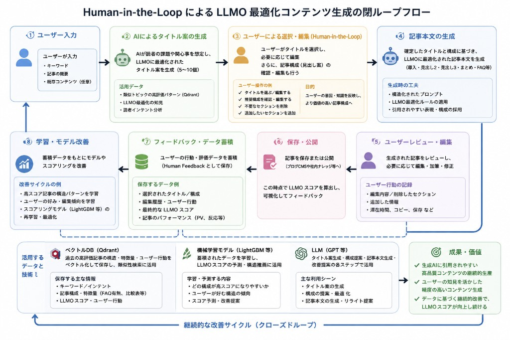

# 課題 2 企画説明

**期間：** 5/13 着手、5/25 提出（約 2 週間）  
**成果物：** ToB 向けの小さな概念デモ。AI が「引用されやすい」候補を複数出し、人が 4 段階で判定して DB に残す。次に AI を呼ぶとき、その判定結果を Prompt に反映する。  
**リポジトリ：** https://github.com/noobexe-x/human-in-the-loop-llm（起動方法は [README](../README.md)、ドキュメント一覧も同 README の `docs/` 節）

以下、提出要件に沿って **着眼点・アプローチ・工夫した点・使用技術** の順でまとめます。

---

### 課題 2 を選んだ理由

課題 1・3 は業務領域が馴染み薄く、短期で深掘りすると領域知識で止まりやすいと判断しました。課題 2 は技術・データプラットフォーム寄りで、これまでの Web 開発経験とつながりやすく、LLMO や Data といった新しいテーマにも触れられるため選びました。

以前の「データ」イメージは、MATLAB や Python で分析して表を出す、といった **科学計算・分析** でした。資料を読んで、Data Platform は **データが流れ続け、積み上がり、インフラ上で受け止める** ものだと理解しました。今回の「判定を DB に残し、次回も使う」流れとも近い考え方です。

### 検証したかったこと

コンテンツは人間向けだけでなく、ChatGPT などの AI が検索・回答で **引用するか** も問題になる（LLMO。あわせて AEO・GEO も調査）。

- AI 任せ：幻覚や表現のブレ  
- 全部手書き：量と更新が追いつかない  

その中間として、次を小さく試しました。

> **AI が候補を出す → 人が 4 段階で判定 → 採用・不採用の理由が次の生成に効く**

チャットボットでも、EC の「おすすめ」でもなく、**社内の少人数が使うコンテンツ治理のミニツール** として位置づけています。

### 参考図：全体像はあるが、今回は一部だけ実装した

調査の段階で、LLMO 向けコンテンツを **Human-in-the-Loop で回し続ける閉ループ** の全体像を整理しました（下図）。  
記事タイトル案の生成から本文、公開、フィードバック蓄積、モデル改善までを **一連の流れとして描いている** のが、この図の位置づけです。

一方、5/13～5/25 の期間で **実際にコードとして落地したのは、そのごく一部** です。  
優先したのは「AI が候補を出す → 人が 4 段階で判定する → 判定結果が次の Prompt に戻る」という **治理ループの芯** だけ。時間とスキルの都合で、図の後半（記事全文・CMS・LLMO スコア・Vector DB・LightGBM など）は **構想に留め、未実装** です。

**言いたいことの整理：** 脱線や手戻りはあったが、「何のためのシステムか」という **全体像は最初から持っていた**。提出物はその全体像に対する **最小の概念実証** であり、図のすべてを作ったわけではない、という理解で読んでください。



#### 図の 8 ステップと、今回の対応（○＝触れた／×＝未実装）

| ステップ | 図で想定していること | 今回の demo |
|----------|----------------------|-------------|
| 1 | キーワード・構成などのユーザー入力 | △ 短文入力のみ |
| 2 | AI によるタイトル案（LLMO 向け複数案） | △ 複数「候補」生成（タイトル専用フローではない） |
| 3 | 人による選択・編集（HITL） | **○** 4 段階判定（採用／修正採用／不採用／要確認） |
| 4 | 記事本文の生成（見出し・FAQ など） | × |
| 5 | ユーザーレビュー・編集の記録 | ×（修正して採用のテキストのみ DB に残す） |
| 6 | 保存・公開・LLMO スコア表示 | × |
| 7 | フィードバック・データ蓄積 | **○** SQLite に判定履歴（デモ規模） |
| 8 | 学習・モデル改善（LightGBM 等） | × |

図下部の **Qdrant／LightGBM／GPT** も、今回は **GPT 互換 API（DeepSeek）で生成部分だけ** 使い、Vector DB と学習モデルは **全体像の要素として理解したが未導入** です。

#### 全体像と demo の関係（一枚で）

```text
【全体像（参考図）】  入力 → タイトル → 人 → 本文 → レビュー → 公開・スコア → 蓄積 → 学習 →（戻る）
【今回落地した範囲】  入力(短) → 候補複数 → 人(4段階) → DB → 次の Prompt →（小さなループ）
```

今後時間をかけるなら、図の **④ 本文生成以降** や、**⑦⑧ の本格的なデータ基盤** に伸ばす想定です（「限界と、続けるなら」および [後続の追加方向.md](./後続の追加方向.md) も参照）。

---

## アプローチ：進め方（途中で方向転換あり）

### 全体の流れ（一枚で）

```text
資料(2日) → fork・API 接続 → ToB化（管理者がアカウント発行）
→ 「片道」：生成→人が選ぶ→DB
→ テスト用データ・ETL
→ 「ループ」：DB の内容を次の Prompt に
→ 【約3日停滞】EC レコメンドっぽくなる → 停止 → 4 段階判定へ
→ seed・Prompt 修正・フォルダ整理 → 提出
```

### スケジュール（5/13～5/25）

| 時期 | 内容 |
|------|------|
| 5/13～14 | dev.to で LLMO、Data Platform、ETL 入門などを読む（初の 2 日は資料中心） |
| 5/15 前後 | Flask + SQLite を決定。チャット系 dashboard を fork。DeepSeek で API 疎通。Docker 化 |
| 5/16～18 | 自己登録なし・管理者発行に変更。入力→AI→人の選択→入库。seed/clear、汚れデータテスト、簡易 ETL |
| 5/19 前後 | ループ：採用・不採用を次の Prompt に連結 |
| **約 3 日** | **偏題期**（下記） |
| 偏題期の後 | 4 段階判定、フォーム・DB 拡張。seed と Prompt を新ロジックに合わせる |
| 5/24～25 | controllers / services へ整理。提出準備 |

日付は記憶ベースで、前後 1～2 日のずれはあります。**偏題した約 3 日** が今回のターニングポイントです。

### 偏題期：「EC っぽい」実装に寄っていた時期

ループまでできた時点では、画面は **候補を 1 つ選ぶ** だけでした。そこから **出現頻度を集計し、次回はその方向を強める** 処理を足していき、**「選ばれたものを多く出す」＝レコメンド／EC 寄り** になっていきました。課題 2 が想定する **LLMO 向けのコンテンツ治理** とずれ、**ほぼ脱線** したと認識しています。

気づいてから **約 3 日間**、その方向の機能追加を止め、資料を読み直し、現状の設計に切り替えました。

- 単一の「選択」ではなく **採用 / 修正して採用 / 不採用 / 要確認** の 4 段階  
- 不採用は理由必須（次の Prompt で避ける）  
- **要確認** は AI に渡さない（未検証の情報で生成を汚さない）  

当時の **出現頻度まわりの実装は最終版には残していません**。提出版の主軸は、4 段階判定とコンテンツライブラリから Prompt へのフィードバックです。

### 参照した資料・コード

**記事（dev.to）：**

- [AEO, GEO, and LLMO](https://dev.to/lovestaco/aeo-geo-and-llmo-the-new-frontier-of-seo-in-the-age-of-ai-4bbj)  
- [Data Platform Architecture Types](https://dev.to/data_mike/data-platform-architecture-types-3bpb)  
- [ETL Pipeline 入門](https://dev.to/gowthampotureddi/etl-pipeline-for-data-engineering-a-beginners-guide-to-extract-transform-and-load-4i1f)  

**LLM 基礎（GitHub）：**

- [mlabonne/llm-course](https://github.com/mlabonne/llm-course) — LLM の学習ロードマップと Colab ノート付きコース。API 呼び出しや RAG・評価などの **全体像を把握するため** に参照した。参考図の Vector DB や学習パイプラインはここで位置づけを理解したが、今回の demo には未導入。

**コード：** GitHub で `flask openai sqlite` を検索し、[Vaga-666/flask-openai-chat-dashboard-](https://github.com/Vaga-666/flask-openai-chat-dashboard-) を fork（ログイン・SQLite・API 呼び出しの土台）。

**自分で追加した部分：** ToB 権限、4 段階判定、コンテンツライブラリ→Prompt、候補の抽出・パース、簡易 ETL、`dbtesttools`、MVC 的なディレクトリ分割。

### 今回あえてやらなかったこと

- **ベクトル DB / 本格 RAG** — 直近の採用・不採用を Prompt に足すだけでループは説明できる  
- **長文・記事単位の入力と全文改善提案** — 時間の都合。入力は短文＋複数候補  
- **課題記載のすべての商用 API** — 日本の支払い条件などで契約できず。OpenAI 互換の DeepSeek を使用（後述）  
- **偏題期の頻度統計・レコメンド型の強化** — 方向転換により最終成果から除外  

---

## 工夫した点

**ToB 化：** 管理者がユーザーを作成し、利用権限を付与。ログイン時にセッションをクリアし、別ユーザーの未判定データが混ざらないようにした。

**段階的に実装：** 片道（人が AI 出力を扱う）→ ループ（DB が Prompt に効く）→ 偏題の修正後に 4 段階判定。

**4 段階判定の意味：**

| 判定 | 意味 | 次の Prompt に入るか |
|------|------|----------------------|
| 採用 | 正例として使う | はい |
| 修正して採用 | 修正後の本文を正例に | はい |
| 不採用 | 理由を記録（ネガティブ制約） | はい（理由） |
| 要確認 | 保留・メモ | **いいえ** |

1 回の API 呼び出しは `AiGeneration` に保存。各判定は `generation_id` で紐づけ、当時の入力と AI の生出力を追えるようにした。

**データと品質：** `dbtesttools` で業務データの削除・日本語のテストデータ投入。入力と候補は簡易 ETL（制御文字、短すぎる文、重複など）を通す。


---

## 成果物：デモで確認できること

```text
入力 → 簡易 ETL → AI が 5～10 候補 → 4 段階判定 → DB → 次の Prompt → 再生成
```

- **管理者：** ユーザー作成、権限 ON/OFF、生成・判定履歴の閲覧  
- **一般ユーザー：** 短文入力 → 候補生成 → 候補ごとに判定 → ラウンド終了  

**ループの見せ方：** 同じテーマで、1 件採用・1 件不採用（理由を具体的に）したあと、もう一度生成すると、候補の傾向が変わることがある。DB に残した治理結果が Prompt に戻っていることを示すため。

---

## 使用した技術

| 区分 | 内容 |
|------|------|
| バックエンド | Python、Flask、Flask-SQLAlchemy |
| 画面 | Jinja2 テンプレート |
| DB | SQLite |
| 生成 AI | DeepSeek（OpenAI 互換 API） |
| その他 | python-dotenv、Docker、Faker、`dbtesttools/` |

**API について：** 課題で挙がっている一部 API は、日本のクレジットカード等の条件により本人では契約できませんでした。OpenAI 互換の DeepSeek でフローを検証しています。実装は特定ベンダーに固定しておらず、設定の差し替えで他 API も想定しています。

---

## 限界と、続けるなら

本成果は **概念実証用デモ** であり、本番投入を想定していません（SQLite、簡易権限、Prompt に載せられる件数の上限、ベクトル検索なし、入力は短文のみ、など）。

今回の優先順位は **「人の治理 → 次の AI 生成へ」** の一通りです。参考図にある以下は **全体像としては押さえているが、今回は落地していない** 部分です。

- 記事全文の生成（構成固定→本文・FAQ まで一気通貫）  
- 長文入力と、全文に対する AI の改善提案対話  
- CMS 公開、LLMO スコアの算出・可視化  
- Vector DB（Qdrant）による高評価記事構造の検索  
- LightGBM 等によるスコア予測・嗜好学習（図のステップ 8）  
- 本格的な承認フロー、引用率 KPI、認証・監査  

詳細な今後の方向は [後続の追加方向.md](./後続の追加方向.md) に分離している。

---

*提出：2026-05-25*
